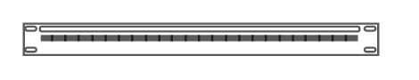

# CAT5e Rack Mount Patch Panel 24 ports

## Definition

```
{
  _style: { 
    entity: 'strokeColor=#666666;html=1;labelPosition=right;align=left;spacingLeft=15;shadow=0;dashed=0;outlineConnect=0;shape=mxgraph.rack.general.cat5e_rack_mount_patch_panel_24_ports;',
  },
  _original_width: 160,
  _original_height: 15,
}
```

## Usage

```
import { Cat5eRackMountPatchPanel24Ports } from '@diac/standard-components-diagrams/rackGeneral'

<Cat5eRackMountPatchPanel24Ports/>
```

## Preview


