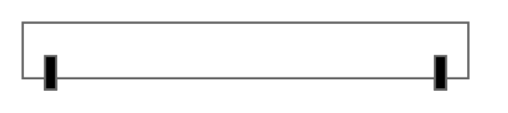

# Channel Base

## Definition

```
{
  _style: { 
    entity: 'strokeColor=#666666;html=1;labelPosition=right;align=left;spacingLeft=15;shadow=0;dashed=0;outlineConnect=0;shape=mxgraph.rackGeneral.channelBase;',
  },
  _original_width: 200,
  _original_height: 30,
}
```

## Usage

```
import { ChannelBase } from '@diac/standard-components-diagrams/rackGeneral'

<ChannelBase/>
```

## Preview


