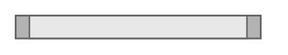

# Cover Plate

## Definition

```
{
  _style: { 
    entity: 'strokeColor=#666666;html=1;labelPosition=right;align=left;spacingLeft=15;shadow=0;dashed=0;outlineConnect=0;shape=mxgraph.rackGeneral.plate;fillColor=#e8e8e8;',
  },
  _original_width: 160,
  _original_height: 15,
}
```

## Usage

```
import { CoverPlate } from '@diac/standard-components-diagrams/rackGeneral'

<CoverPlate/>
```

## Preview


