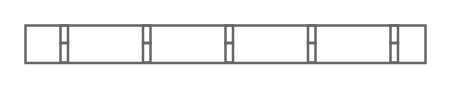

# Horizontal Cable Duct

## Definition

```
{
  _style: 'strokeColor=#666666;html=1;labelPosition=right;align=left;spacingLeft=15;shadow=0;dashed=0;outlineConnect=0;shape=mxgraph.rackGeneral.horCableDuct;',
  _width: 160,
  _height: 15,
}
```

## Usage

```
import { HorizontalCableDuct } from '@reactiac/standard-components-diagrams/rackGeneral'

<HorizontalCableDuct/>
```

## Preview


