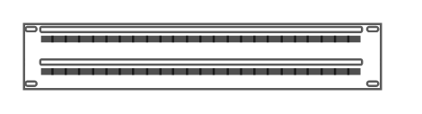

# Rack General Entities

- [CabinetLeg](./cabinet-leg.md)  

- [Cat5eEnhancedPatchPanel48Ports](./cat5e-enhanced-patch-panel-48-ports.md)  

- [Cat5eRackMountPatchPanel24Ports](./cat5e-rack-mount-patch-panel-24-ports.md)  

- [Cat5eRackMountPatchPanel96Ports](./cat5e-rack-mount-patch-panel-96-ports.md)  

- [ChannelBase](./channel-base.md)  

- [CoverPlate](./cover-plate.md)  

- [HorizontalCableDuct](./horizontal-cable-duct.md)  

- [HorizontalRoutingBank](./horizontal-routing-bank.md)  

- [Hub](./hub.md)  

- [NeatPatch](./neat-patch.md)  

- [Server](./server.md)  

- [Server1](./server-1.md)  

- [Server2](./server-2.md)  

- [Server3](./server-3.md)  

- [Spacing](./spacing.md)  

- [Switches1](./switches-1.md)  

- [Switches2](./switches-2.md)  

