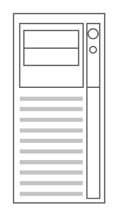

# Server 2

## Definition

```
{
  _style: 'strokeColor=#666666;html=1;verticalLabelPosition=bottom;labelBackgroundColor=#ffffff;verticalAlign=top;outlineConnect=0;shadow=0;dashed=0;shape=mxgraph.rack.general.server_2;',
  _width: 73,
  _height: 150,
}
```

## Usage

```
import { Server2 } from '@diac/standard-components-diagrams/rackGeneral'

<Server2/>
```

## Preview


