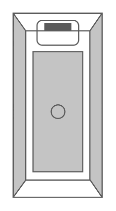

# Server 3

## Definition

```
{
  _style: { 
    entity: 'strokeColor=#666666;html=1;verticalLabelPosition=bottom;labelBackgroundColor=#ffffff;verticalAlign=top;outlineConnect=0;shadow=0;dashed=0;shape=mxgraph.rack.general.server_3;',
  },
  _original_width: 73,
  _original_height: 150,
}
```

## Usage

```
import { Server3 } from '@dinghy/standard-components-diagrams/rackGeneral'

<Server3/>
```

## Preview


