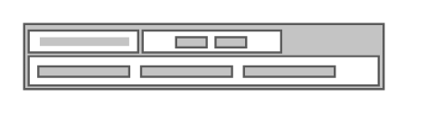

# Switches 1

## Definition

```
{
  _style: { 
    entity: 'strokeColor=#666666;html=1;labelPosition=right;align=left;spacingLeft=15;shadow=0;dashed=0;outlineConnect=0;shape=mxgraph.rack.general.switches_1;',
  },
  _width: 160,
  _height: 30,
}
```

## Usage

```
import { Switches1 } from '@diac/standard-components-diagrams/rackGeneral'

<Switches1/>
```

## Preview


