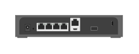

# Aruba 9004 4-Port GbE Gateway (front)

## Definition

```
{
  _style: { 
    entity: 'html=1;verticalLabelPosition=bottom;verticalAlign=top;outlineConnect=0;shadow=0;dashed=0;shape=mxgraph.rack.hpe_aruba.gateways_controllers.aruba_9004_4_port_gbe_gateway_back;',
  },
  _original_width: 71,
  _original_height: 15,
}
```

## Usage

```
import { Aruba90044PortGbeGatewayFront } from '@diac/standard-components-diagrams/rackHpeArubaSwitches'

<Aruba90044PortGbeGatewayFront/>
```

## Preview


