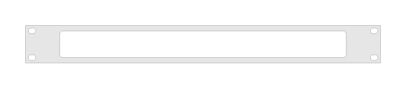

# Aruba 9004 dual rackmount

## Definition

```
{
  _style: 'html=1;verticalLabelPosition=bottom;verticalAlign=top;outlineConnect=0;shadow=0;dashed=0;shape=mxgraph.rack.hpe_aruba.gateways_controllers.aruba_9004_dual_rackmount;',
  _width: 142,
  _height: 15,
}
```

## Usage

```
import { Aruba9004DualRackmount } from '@reactiac/standard-components-diagrams/rackHpeArubaSwitches'

<Aruba9004DualRackmount/>
```

## Preview


