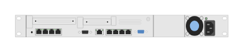

# Aruba ClearPass C3000 (rear)

## Definition

```
{
  _style: { 
    entity: 'html=1;verticalLabelPosition=bottom;verticalAlign=top;outlineConnect=0;shadow=0;dashed=0;shape=mxgraph.rack.hpe_aruba.security.aruba_clearpass_c3000_rear;',
  },
  _original_width: 142,
  _original_height: 15,
}
```

## Usage

```
import { ArubaClearpassC3000Rear } from '@diac/standard-components-diagrams/rackHpeArubaSwitches'

<ArubaClearpassC3000Rear/>
```

## Preview


