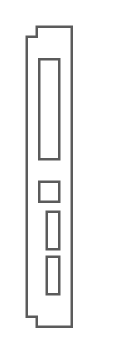

# HP 6125G Ethernet Blade Switch

## Definition

```
{
  _style: { 
    entity: 'shape=mxgraph.rack.hp.hp_6125g_ethernet_blade_switch;html=1;labelPosition=right;align=left;spacingLeft=15;dashed=0;shadow=0;fillColor=#ffffff;',
  },
  _width: 19,
  _height: 121,
}
```

## Usage

```
import { Hp6125gEthernetBladeSwitch } from '@diac/standard-components-diagrams/rackHpeArubaSwitches'

<Hp6125gEthernetBladeSwitch/>
```

## Preview


