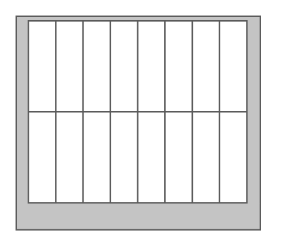

# HP BladeSystem c7000 Enclosure

## Definition

```
{
  _style: { 
    entity: 'shape=mxgraph.rack.hp.hp_bladesystem_c7000_enclosure;html=1;labelPosition=right;align=left;spacingLeft=15;dashed=0;shadow=0;fillColor=#ffffff;',
  },
  _width: 161,
  _height: 141,
}
```

## Usage

```
import { HpBladesystemC7000Enclosure } from '@diac/standard-components-diagrams/rackHpeArubaSwitches'

<HpBladesystemC7000Enclosure/>
```

## Preview


