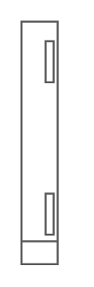

# HP ProLiant BL660c Server Blade

## Definition

```
{
  _style: 'shape=mxgraph.rack.hp.hp_proliant_bl660c_server_blade;html=1;labelPosition=right;align=left;spacingLeft=15;dashed=0;shadow=0;fillColor=#ffffff;',
  _width: 19,
  _height: 121,
}
```

## Usage

```
import { HpProliantBl660cServerBlade } from '@reactiac/standard-components-diagrams/rackHpeArubaSwitches'

<HpProliantBl660cServerBlade/>
```

## Preview


