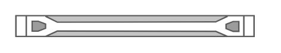

# HP ProLiant DL320e G8

## Definition

```
{
  _style: 'shape=mxgraph.rack.hp.hp_proliant_dl320e_g8;html=1;labelPosition=right;align=left;spacingLeft=15;dashed=0;shadow=0;fillColor=#ffffff;',
  _width: 161,
  _height: 15,
}
```

## Usage

```
import { HpProliantDl320eG8 } from '@reactiac/standard-components-diagrams/rackHpeArubaSwitches'

<HpProliantDl320eG8/>
```

## Preview


