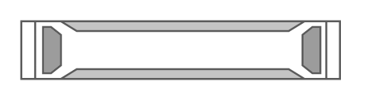

# HP ProLiant DL385p G8

## Definition

```
{
  _style: { 
    entity: 'shape=mxgraph.rack.hp.hp_proliant_dl385p_g8;html=1;labelPosition=right;align=left;spacingLeft=15;dashed=0;shadow=0;fillColor=#ffffff;',
  },
  _original_width: 161,
  _original_height: 30,
}
```

## Usage

```
import { HpProliantDl385pG8 } from '@diac/standard-components-diagrams/rackHpeArubaSwitches'

<HpProliantDl385pG8/>
```

## Preview


