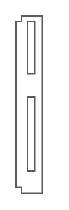

# HP Virtual Connect Flex-10-10D

## Definition

```
{
  _style: 'shape=mxgraph.rack.hp.hp_virtual_connect_flex-10-10d;html=1;labelPosition=right;align=left;spacingLeft=15;dashed=0;shadow=0;fillColor=#ffffff;',
  _width: 19,
  _height: 121,
}
```

## Usage

```
import { HpVirtualConnectFlex1010d } from '@diac/standard-components-diagrams/rackHpeArubaSwitches'

<HpVirtualConnectFlex1010d/>
```

## Preview


