# Rack HPE Aruba Entities

- [Aruba7010MobilityControllerFront](./aruba-7010-mobility-controller-front.md)  

- [Aruba7010MobilityControllerRear](./aruba-7010-mobility-controller-rear.md)  

- [Aruba7024MobilityControllerFront](./aruba-7024-mobility-controller-front.md)  

- [Aruba7024MobilityControllerRear](./aruba-7024-mobility-controller-rear.md)  

- [Aruba7030MobilityControllerFront](./aruba-7030-mobility-controller-front.md)  

- [Aruba7030MobilityControllerRear](./aruba-7030-mobility-controller-rear.md)  

- [Aruba7205MobilityControllerFront](./aruba-7205-mobility-controller-front.md)  

- [Aruba7205MobilityControllerRear](./aruba-7205-mobility-controller-rear.md)  

- [Aruba7210MobilityControllerFront](./aruba-7210-mobility-controller-front.md)  

- [Aruba7210MobilityControllerRear](./aruba-7210-mobility-controller-rear.md)  

- [Aruba7220MobilityControllerFront](./aruba-7220-mobility-controller-front.md)  

- [Aruba7220MobilityControllerRear](./aruba-7220-mobility-controller-rear.md)  

- [Aruba7240MobilityControllerFront](./aruba-7240-mobility-controller-front.md)  

- [Aruba7240MobilityControllerRear](./aruba-7240-mobility-controller-rear.md)  

- [Aruba7280MobilityControllerFront](./aruba-7280-mobility-controller-front.md)  

- [Aruba7280MobilityControllerRear](./aruba-7280-mobility-controller-rear.md)  

- [Aruba90044PortGbeGatewayBack](./aruba-9004-4-port-gbe-gateway-back.md)  

- [Aruba90044PortGbeGatewayFront](./aruba-9004-4-port-gbe-gateway-front.md)  

- [Aruba9004DualRackmount](./aruba-9004-dual-rackmount.md)  

- [Aruba901210PortGbeGatewayBack](./aruba-9012-10-port-gbe-gateway-back.md)  

- [Aruba901210PortGbeGatewayFront](./aruba-9012-10-port-gbe-gateway-front.md)  

- [ArubaClearpassC1000Front](./aruba-clearpass-c1000-front.md)  

- [ArubaClearpassC1000Front2](./aruba-clearpass-c1000-front-2.md)  

- [ArubaClearpassC1000Rear](./aruba-clearpass-c1000-rear.md)  

- [ArubaClearpassC2000Front](./aruba-clearpass-c2000-front.md)  

- [ArubaClearpassC2000Rear](./aruba-clearpass-c2000-rear.md)  
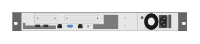

- [ArubaClearpassC3000Front](./aruba-clearpass-c3000-front.md)  

- [ArubaClearpassC3000Rear](./aruba-clearpass-c3000-rear.md)  

- [ArubaMobilityMaster10kFront](./aruba-mobility-master-10k-front.md)  

- [ArubaMobilityMaster10kRear](./aruba-mobility-master-10k-rear.md)  

- [ArubaMobilityMaster1kFront](./aruba-mobility-master-1k-front.md)  

- [ArubaMobilityMaster1kRear](./aruba-mobility-master-1k-rear.md)  

- [ArubaMobilityMaster5kFront](./aruba-mobility-master-5k-front.md)  

- [ArubaMobilityMaster5kRear](./aruba-mobility-master-5k-rear.md)  

- [DirectQsfp](./direct-qsfp.md)  

- [DirectQsfp2](./direct-qsfp-2.md)  

- [DirectSfp](./direct-sfp.md)  

- [FibreQsfp](./fibre-qsfp.md)  

- [Hp6125gEthernetBladeSwitch](./hp-6125g-ethernet-blade-switch.md)  

- [HpBladesystemC3000Enclosure](./hp-bladesystem-c3000-enclosure.md)  

- [HpBladesystemC7000Enclosure](./hp-bladesystem-c7000-enclosure.md)  

- [HpBladesystemS6500Enclosure](./hp-bladesystem-s6500-enclosure.md)  

- [HpInfinibandFdrSwitch](./hp-infiniband-fdr-switch.md)  
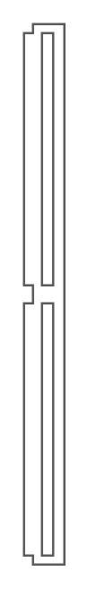

- [HpProliantBl620cServerBlade](./hp-proliant-bl620c-server-blade.md)  

- [HpProliantBl660cServerBlade](./hp-proliant-bl660c-server-blade.md)  

- [HpProliantBl685cServerBlade](./hp-proliant-bl685c-server-blade.md)  

- [HpProliantDl160G8](./hp-proliant-dl160-g8.md)  
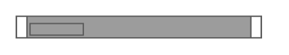

- [HpProliantDl320eG8](./hp-proliant-dl320e-g8.md)  

- [HpProliantDl360eG8](./hp-proliant-dl360e-g8.md)  

- [HpProliantDl360pG8](./hp-proliant-dl360p-g8.md)  

- [HpProliantDl380eG8](./hp-proliant-dl380e-g8.md)  

- [HpProliantDl380pG8](./hp-proliant-dl380p-g8.md)  
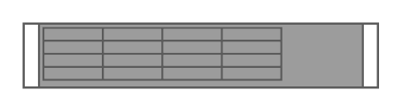

- [HpProliantDl385pG8](./hp-proliant-dl385p-g8.md)  

- [HpProliantDl560G8](./hp-proliant-dl560-g8.md)  

- [HpProliantSl230sG8](./hp-proliant-sl230s-g8.md)  
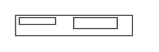

- [HpProliantSl250sG8](./hp-proliant-sl250s-g8.md)  

- [HpVirtualConnectFlex1010d](./hp-virtual-connect-flex-10-10d.md)  

- [J9772a253048gPoeSwitch](./j9772a-2530-48g-poe-switch.md)  
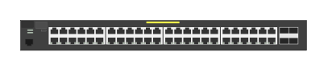

- [J9773a253024gPoeSwitch](./j9773a-2530-24g-poe-switch.md)  

- [J9774a25308gPoeFront](./j9774a-2530-8g-poe-front.md)  

- [J9774a25308gPoeplusRear](./j9774a-2530-8g-poeplus-rear.md)  

- [J9775a253048gSwitch](./j9775a-2530-48g-switch.md)  

- [J9776a253024gSwitch](./j9776a-2530-24g-switch.md)  

- [J9777a25308gFront](./j9777a-2530-8g-front.md)  

- [J9777a25308gRear](./j9777a-2530-8g-rear.md)  

- [J9778a253048PoeFront](./j9778a-2530-48-poe-front.md)  
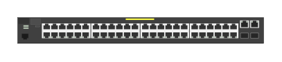

- [J9780a25308PoeFront](./j9780a-2530-8-poe-front.md)  

- [J9780a25308PoeRear](./j9780a-2530-8-poe-rear.md)  

- [J9781a253048Front](./j9781a-2530-48-front.md)  

- [J9782a253024Front](./j9782a-2530-24-front.md)  

- [J9821a540rZl2SwitchRear](./j9821a-540r-zl2-switch-rear.md)  

- [J9822a5412rZl2Switch](./j9822a-5412r-zl2-switch.md)  

- [J9822a5412rZl2SwitchRear](./j9822a-5412r-zl2-switch-rear.md)  

- [J9827a5400rManagementModule](./j9827a-5400r-management-module.md)  

- [J9828a5400r700wPoeZl2PowerSupply](./j9828a-5400r-700w-poe-zl2-power-supply.md)  

- [J9829a5400r1100wPoeZl2PowerSupply](./j9829a-5400r-1100w-poe-zl2-power-supply.md)  

- [J9830b5400r2750wPoeZl2PowerSupply](./j9830b-5400r-2750w-poe-zl2-power-supply.md)  
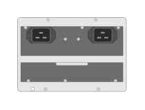

- [J9831a5406rZl2SwitchFanTray](./j9831a-5406r-zl2-switch-fan-tray.md)  

- [J9832a5412rZl2SwitchFanTray](./j9832a-5412r-zl2-switch-fan-tray.md)  

- [J9840aMsm775zlV2ZlModule](./j9840a-msm-775zl-v2-zl-module.md)  

- [J9850a5406rZl2SwitchRear](./j9850a-5406r-zl2-switch-rear.md)  

- [J9850a540rZl2Switch](./j9850a-540r-zl2-switch.md)  

- [J9851a5412rZl2Switch](./j9851a-5412r-zl2-switch.md)  
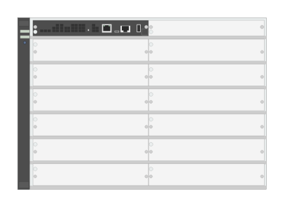

- [J9851a5412rZl2SwitchRear](./j9851a-5412r-zl2-switch-rear.md)  

- [J9853a253048gPoe2sfpSwitch](./j9853a-2530-48g-poe-2sfp-switch.md)  

- [J9854a253024gPoe2sfpSwitch](./j9854a-2530-24g-poe-2sfp-switch.md)  

- [J9855a253048g2sfpSwitch](./j9855a-2530-48g-2sfp-switch.md)  
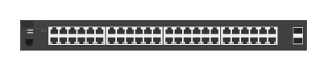

- [J9856a253024g2sfpSwitch](./j9856a-2530-24g-2sfp-switch.md)  

- [J9857aAdvSvcsV2ZlModule](./j9857a-adv-svcs-v2-zl-module.md)  

- [J9858aAdvSvcsV2ZlModule](./j9858a-adv-svcs-v2-zl-module.md)  
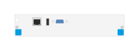

- [J993a8Port1g10gbeSfpWithMacsecV3Zl2Module](./j993a-8-port-1g-10gbe-sfp-with-macsec-v3-zl2-module.md)  

- [J9986a24pGigtModule](./j9986a-24p-gigt-module.md)  

- [J9987a24Port101001000baseTWithMacsecV3Zl2Module](./j9987a-24-port-10-100-1000base-t-with-macsec-v3-zl2-module.md)  

- [J9988a24Port1gbeSfpWithMagsecV3Zl2Module](./j9988a-24-port-1gbe-sfp-with-magsec-v3-zl2-module.md)  

- [J9989a12Port101001000baseTPoeAnd12Port1gbeSfpWithMacsecV3Zl2Module](./j9989a-12-port-10-100-1000base-t-poe-and-12-port-1gbe-sfp-with-macsec-v3-zl2-module.md)  
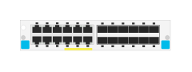

- [J9990a20pGigt4pSfpModule](./j9990a-20p-gigt-4p-sfp-module.md)  

- [J9991a20Port101001000baseTPoeAnd4Port125510gbaseTPoeWithMacsecV3Zl2Module](./j9991a-20-port-10-100-1000base-t-poe-and-4-port-1-2-5-5-10gbase-t-poe-with-macsec-v3-zl2-module.md)  

- [J9992a20Port101001000baseTPoeAnd1Port40gbeQsfpWithMacsecV3Zl2Module](./j9992a-20-port-10-100-1000base-t-poe-and-1-port-40gbe-qsfp-with-macsec-v3-zl2-module.md)  

- [J9995a8pSmartRatePoeModule](./j9995a-8p-smart-rate-poe-module.md)  

- [J9996a2Port40gbeQsfpWithMacsecV3Zl2Module](./j9996a-2-port-40gbe-qsfp-with-macsec-v3-zl2-module.md)  

- [Jl070a25308PoeInternalPsSwitch](./jl070a-2530-8-poe-internal-ps-switch.md)  

- [Jl071aHpeAruba3810m24PortGt1SlotSwitch](./jl071a-hpe-aruba-3810m-24-port-gt-1-slot-switch.md)  

- [Jl071aHpeAruba3810m24PortGt1SlotSwitchRear](./jl071a-hpe-aruba-3810m-24-port-gt-1-slot-switch-rear.md)  
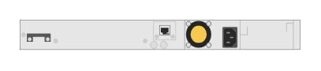

- [Jl072aHpeAruba3810m48PortGt1SlotSwitch](./jl072a-hpe-aruba-3810m-48-port-gt-1-slot-switch.md)  

- [Jl072aHpeAruba3810m48PortGt1SlotSwitchRear](./jl072a-hpe-aruba-3810m-48-port-gt-1-slot-switch-rear.md)  

- [Jl073aHpeAruba3810m24PortGtPoe1SlotSwitchRear](./jl073a-hpe-aruba-3810m-24-port-gt-poe-1-slot-switch-rear.md)  
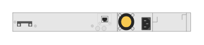

- [Jl073aHpeAruba3810m24PortGtPoeplus1SlotSwitch](./jl073a-hpe-aruba-3810m-24-port-gt-poeplus-1-slot-switch.md)  

- [Jl074aHpeAruba3810m48PortGtPoe1SlotSwitch](./jl074a-hpe-aruba-3810m-48-port-gt-poe-1-slot-switch.md)  

- [Jl075aHpeAruba3810m16PortSfp2SlotSwitch](./jl075a-hpe-aruba-3810m-16-port-sfp-2-slot-switch.md)  

- [Jl075aHpeAruba3810m16PortSfp2SlotSwitchRear](./jl075a-hpe-aruba-3810m-16-port-sfp-2-slot-switch-rear.md)  

- [Jl076aHpeAruba3810m40PortGtPoe8Port125510gbaseTPoe1SlotSwitch](./jl076a-hpe-aruba-3810m-40-port-gt-poe-8-port-1-2-5-5-10gbase-t-poe-1-slot-switch.md)  

- [Jl076aHpeAruba3810m40PortGtPoe8Port125510gbaseTPoe1SlotSwitchRear](./jl076a-hpe-aruba-3810m-40-port-gt-poe-8-port-1-2-5-5-10gbase-t-poe-1-slot-switch-rear.md)  

- [Jl079a3810m2930m2Port40gbeQsfpModule](./jl079a3810m-2930m-2-port-40gbe-qsfp-module.md)  

- [Jl081a3810m2930m4125510GbeHpeSmartRateModule](./jl081a-3810m-2930m-4-1-2-5-5-10-gbe-hpe-smart-rate-module.md)  

- [Jl083a3810m2930m4Port10gbeSfpModule](./jl083a-3810m-2930m-4-port-10gbe-sfp-module.md)  
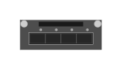

- [Jl084a3810m2930m4PortStackingModule](./jl084a-3810m-2930m-4-port-stacking-module.md)  

- [Jl085aAruba6300mPsuModule](./jl085a-aruba-6300m-psu-module.md)  

- [Jl086aAruba6300mPsuModule](./jl086a-aruba-6300m-psu-module.md)  
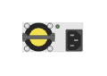

- [Jl087a3810m2930m1Port40gbeQsfpModule](./jl087a-3810m-2930m-1-port-40gbe-qsfp-module.md)  

- [Jl087aAruba6300mPsuModule](./jl087a-aruba-6300m-psu-module.md)  
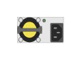

- [Jl253aAruba2930f24g4sfpSwitch](./jl253a-aruba-2930f-24g-4sfp-switch.md)  

- [Jl254aAruba2930f48g4sfpSwitch](./jl254a-aruba-2930f-48g-4sfp-switch.md)  
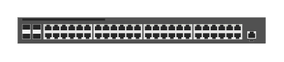

- [Jl255aAruba2930f24gPoe4sfpSwitch](./jl255a-aruba-2930f-24g-poe-4sfp-switch.md)  

- [Jl256aAruba2930f48gPoe4sfpSwitch](./jl256a-aruba-2930f-48g-poe-4sfp-switch.md)  

- [Jl258aAruba2930f8gPoe2sfpRear](./jl258a-aruba-2930f-8g-poe-2sfp-rear.md)  

- [Jl258aAruba2930f8gPoe2sfpSwitch](./jl258a-aruba-2930f-8g-poe-2sfp-switch.md)  

- [Jl258aAruba2930f8gPoe2sfpSwitchRear](./jl258a-aruba-2930f-8g-poe-2sfp-switch-rear.md)  

- [Jl259aAruba2930f24g4sfpSwitch](./jl259a-aruba-2930f-24g-4sfp-switch.md)  

- [Jl260aAruba2930f48g4sfpSwitch](./jl260a-aruba-2930f-48g-4sfp-switch.md)  

- [Jl261aAruba2930f24gPoe4sfpSwitch](./jl261a-aruba-2930f-24g-poe-4sfp-switch.md)  

- [Jl262aAruba2930f48gPoe4sfpSwitch](./jl262a-aruba-2930f-48g-poe-4sfp-switch.md)  
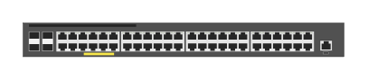

- [Jl263aAruba2930f24gPoe4sfpTaaSwitch](./jl263a-aruba-2930f-24g-poe-4sfp-taa-switch.md)  

- [Jl264aAruba2930f48gPoe4sfpTaaSwitch](./jl264a-aruba-2930f-48g-poe-4sfp-taa-switch.md)  

- [Jl319aAruba2930m24g1SlotSwitch](./jl319a-aruba-2930m-24g-1-slot-switch.md)  

- [Jl319aAruba2930m24g1SlotSwitchRear](./jl319a-aruba-2930m-24g-1-slot-switch-rear.md)  

- [Jl320aAruba2930m24gPoe1SlotSwitch](./jl320a-aruba-2930m-24g-poe-1-slot-switch.md)  

- [Jl320aAruba2930m24gPoe1SlotSwitchRear](./jl320a-aruba-2930m-24g-poe-1-slot-switch-rear.md)  

- [Jl321aAruba2930m48g1SlotSwitch](./jl321a-aruba-2930m-48g-1-slot-switch.md)  
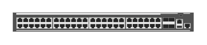

- [Jl321aAruba2930m48g1SlotSwitchRear](./jl321a-aruba-2930m-48g-1-slot-switch-rear.md)  

- [Jl322aAruba2930m48gPoe1SlotSwitch](./jl322a-aruba-2930m-48g-poe-1-slot-switch.md)  
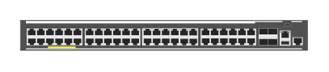

- [Jl322aAruba2930m48gPoe1SlotSwitchRear](./jl322a-aruba-2930m-48g-poe-1-slot-switch-rear.md)  

- [Jl323aAruba2930m40g8SmartRatePoe1SlotSwitch](./jl323a-aruba-2930m-40g-8-smart-rate-poe-1-slot-switch.md)  
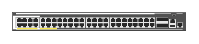

- [Jl324aAruba2930m24SmartRatePoe1SlotSwitch](./jl324a-aruba-2930m-24-smart-rate-poe-1-slot-switch.md)  

- [Jl325a2930m2PortStackingModule](./jl325a-2930m-2-port-stacking-module.md)  

- [Jl354aAruba254024g4sfpSwitch](./jl354a-aruba-2540-24g-4sfp-switch.md)  

- [Jl355aAruba254048g4sfpSwitch](./jl355a-aruba-2540-48g-4sfp-switch.md)  

- [Jl356aAruba254024gPoe4sfpSwitch](./jl356a-aruba-2540-24g-poe-4sfp-switch.md)  

- [Jl357aAruba254048gPoe4sfpSwitch](./jl357a-aruba-2540-48g-poe-4sfp-switch.md)  

- [Jl363a32pSfpAdv](./jl363a-32p-sfp-adv.md)  

- [Jl365a8pQsfpAdv](./jl365a-8p-qsfp-adv.md)  

- [Jl366a6pQsfp28Adv](./jl366a-6p-qsfp28-adv.md)  

- [Jl368aAruba8400MgmtMod](./jl368a-aruba-8400-mgmt-mod.md)  

- [Jl369aAruba8400X731FanTray](./jl369a-aruba-8400-x731-fan-tray.md)  

- [Jl370aAruba8400FanForX731FanTray](./jl370a-aruba-8400-fan-for-x731-fan-tray.md)  

- [Jl371aAruba8400FanTrayAnd6FansBundle](./jl371a-aruba-8400-fan-tray-and-6-fans-bundle.md)  

- [Jl375aAruba8400Front](./jl375a-aruba-8400-front.md)  

- [Jl375aAruba8400RearEmpty](./jl375a-aruba-8400-rear-empty.md)  

- [Jl375aAruba8400Rear](./jl375a-aruba-8400-rear.md)  
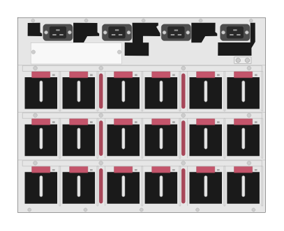

- [Jl376aAruba8400Front](./jl376a-aruba-8400-front.md)  
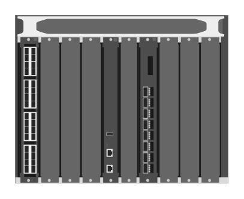

- [Jl376aAruba8400RearEmpty](./jl376a-aruba-8400-rear-empty.md)  

- [Jl376aAruba8400Rear](./jl376a-aruba-8400-rear.md)  

- [Jl479aAruba832048p10gSfpSfpAnd6p40gQsfp5Fan2PsSwitchBundleRear](./jl479a-aruba-8320-48p-10g-sfp-sfp-and-6p-40g-qsfp-5-fan-2-ps-switch-bundle-rear.md)  

- [Jl479aAruba832048p10gSfpSfpAnd6p40gQsfp5Fan2PsSwitchBundle](./jl479a-aruba-8320-48p-10g-sfp-sfp-and-6p-40g-qsfp-5-fan-2-ps-switch-bundle.md)  
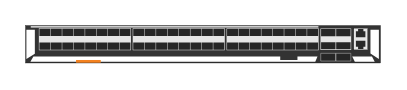

- [Jl557aAruba2930f48gPoe4sfp740wSwitch](./jl557a-aruba-2930f-48g-poe-4sfp-740w-switch.md)  
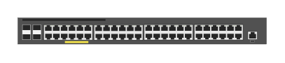

- [Jl557aAruba2930f48gPoe4sfp740wSwitchRear](./jl557a-aruba-2930f-48g-poe-4sfp-740w-switch-rear.md)  

- [Jl558aAruba2930f48gPoe4sfp740wSwitch](./jl558a-aruba-2930f-48g-poe-4sfp-740w-switch.md)  

- [Jl558aAruba2930f48gPoe4sfp740wSwitchRear](./jl558a-aruba-2930f-48g-poe-4sfp-740w-switch-rear.md)  

- [Jl559aAruba2930f48gPoe4sfp740wTaaSwitch](./jl559a-aruba-2930f-48g-poe-4sfp-740w-taa-switch.md)  

- [Jl559aAruba2930f48gPoe4sfp740wTaaSwitchRear](./jl559a-aruba-2930f-48g-poe-4sfp-740w-taa-switch-rear.md)  

- [Jl579aAruba832032p40gQsfp5Fans2PsSwitchBundle](./jl579a-aruba-8320-32p-40g-qsfp-5-fans-2-ps-switch-bundle.md)  

- [Jl579aAruba832032p40gQsfp5Fans2PsSwitchBundleRear](./jl579a-aruba-8320-32p-40g-qsfp-5-fans-2-ps-switch-bundle-rear.md)  

- [Jl581aAruba832048p1g10gbaseTAnd6p40gQsfp5Fans2PsSwitchBundle](./jl581a-aruba-8320-48p-1g-10gbase-t-and-6p-40g-qsfp-5-fans-2-ps-switch-bundle.md)  
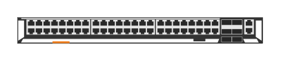

- [Jl581aAruba832048p1g10gbaseTAnd6p40gQsfp5Fans2PsSwitchBundleRear](./jl581a-aruba-8320-48p-1g-10gbase-t-and-6p-40g-qsfp-5-fans-2-ps-switch-bundle-rear.md)  
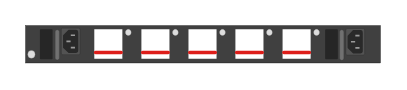

- [Jl624aAruba832532y8cF2bFront](./jl624a-aruba-8325-32y8c-f2b-front.md)  

- [Jl624aAruba832532y8cF2bRear](./jl624a-aruba-8325-32y8c-f2b-rear.md)  

- [Jl625aAruba832532y8cB2fFront](./jl625a-aruba-8325-32y-8c-b2f-front.md)  

- [Jl625aAruba832532y8cB2fRear](./jl625a-aruba-8325-32y-8c-b2f-rear.md)  

- [Jl626aAruba832532cF2bFront](./jl626a-aruba-8325-32c-f2b-front.md)  

- [Jl626aAruba832532cF2bRear](./jl626a-aruba-8325-32c-f2b-rear.md)  

- [Jl627aAruba832532cB2fFront](./jl627a-aruba-8325-32c-b2f-front.md)  

- [Jl627aAruba832532cB2fRear](./jl627a-aruba-8325-32c-b2f-rear.md)  

- [Jl658aAruba6300m24PortSfpAnd4PortSfp56Switch](./jl658a-aruba-6300m-24-port-sfp-and-4-port-sfp56-switch.md)  

- [Jl658aAruba6300m24PortSfpAnd4PortSfp56SwitchRear](./jl658a-aruba-6300m-24-port-sfp-and-4-port-sfp56-switch-rear.md)  
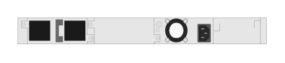

- [Jl659aAruba6300m48PortHpeSmartRate1255gbeClass6PoeAnd4PortSwitch](./jl659a-aruba-6300m-48-port-hpe-smart-rate-1-2-5-5gbe-class-6-poe-and-4-port-switch.md)  

- [Jl659aAruba6300m48PortHpeSmartRate1255gbeClass6PoeAnd4PortSwitchRear](./jl659a-aruba-6300m-48-port-hpe-smart-rate-1-2-5-5gbe-class-6-poe-and-4-port-switch-rear.md)  

- [Jl660aAruba6300m24PortHpeSmartRate1255GbeClass6PoeAnd4PortSwitch](./jl660a-aruba-6300m-24-port-hpe-smart-rate-1-2-5-5-gbe-class-6-poe-and-4-port-switch.md)  

- [Jl660aAruba6300m24PortHpeSmartRate1255GbeClass6PoeAnd4PortSwitchRear](./jl660a-aruba-6300m-24-port-hpe-smart-rate-1-2-5-5-gbe-class-6-poe-and-4-port-switch-rear.md)  

- [Jl661aAruba6300m48Port1gbeClass4PoeAnd4PortSfp56Switch](./jl661a-aruba-6300m-48-port-1gbe-class-4-poe-and-4-port-sfp56-switch.md)  
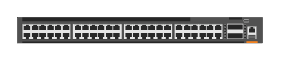

- [Jl661aAruba6300m48Port1gbeClass4PoeAnd4PortSfp56SwitchRear](./jl661a-aruba-6300m-48-port-1gbe-class-4-poe-and-4-port-sfp56-switch-rear.md)  

- [Jl662aAruba6300m24Port1gbeClass4Poe4PortSfp56Switch](./jl662a-aruba-6300m-24-port-1gbe-class-4-poe-4-port-sfp56-switch.md)  

- [Jl662aAruba6300m24Port1gbeClass4Poe4PortSfp56SwitchRear](./jl662a-aruba-6300m-24-port-1gbe-class-4-poe-4-port-sfp56-switch-rear.md)  

- [Jl663aAruba6300m48Port1gbeAnd4PortSfp56Switch](./jl663a-aruba-6300m-48-port-1gbe-and-4-port-sfp56-switch.md)  

- [Jl663aAruba6300m48Port1gbeAnd4PortSfp56SwitchRear](./jl663a-aruba-6300m-48-port-1gbe-and-4-port-sfp56-switch-rear.md)  

- [Jl664aAruba6300m24Port1gbeAnd4PortSfp56Switch](./jl664a-aruba-6300m-24-port-1gbe-and-4-port-sfp56-switch.md)  

- [Jl664aAruba6300m24Port1gbeAnd4PortSfp56SwitchRear](./jl664a-aruba-6300m-24-port-1gbe-and-4-port-sfp56-switch-rear.md)  

- [Jl665aAruba6300f48Port1gbeClass4PoeAnd4PortSfp56Switch](./jl665a-aruba-6300f-48-port-1gbe-class-4-poe-and-4-port-sfp56-switch.md)  
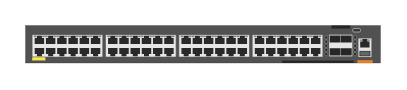

- [Jl665aAruba6300f48Port1gbeClass4PoeAnd4PortSfp56SwitchRear](./jl665a-aruba-6300f-48-port-1gbe-class-4-poe-and-4-port-sfp56-switch-rear.md)  

- [Jl666aAruba6300f24Port1gbeClass4PoeAnd4PortSfp56Switch](./jl666a-aruba-6300f-24-port-1gbe-class-4-poe-and-4-port-sfp56-switch.md)  

- [Jl666aAruba6300f24Port1gbeClass4PoeAnd4PortSfp56SwitchRear](./jl666a-aruba-6300f-24-port-1gbe-class-4-poe-and-4-port-sfp56-switch-rear.md)  

- [Jl667aAruba6300f48Port1gbeAnd4PortSfp56Switch](./jl667a-aruba-6300f-48-port-1gbe-and-4-port-sfp56-switch.md)  

- [Jl667aAruba6300f48Port1gbeAnd4PortSfp56SwitchRear](./jl667a-aruba-6300f-48-port-1gbe-and-4-port-sfp56-switch-rear.md)  

- [Jl668aAruba6300f24Port1gbeAnd4PortSfp56Rear](./jl668a-aruba-6300f-24-port-1gbe-and-4-port-sfp56-rear.md)  

- [Jl668aAruba6300f24Port1gbeAnd4PortSfp56Switch](./jl668a-aruba-6300f-24-port-1gbe-and-4-port-sfp56-switch.md)  

- [Jl669Aruba6300mFanModule](./jl669-aruba-6300m-fan-module.md)  

- [Jl670aAruba6300mPsuModule](./jl670a-aruba-6300m-psu-module.md)  
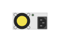

- [Jl687aAruba8400x32y32p11025gSfpSfpSfp28Module](./jl687a-aruba-8400x-32y-32p-1-10-25g-sfp-sfp-sfp28-module.md)  

- [Jl693aAruba12gPoe2g2sfpSwitch](./jl693a-aruba-12g-poe-2g-2sfp-switch.md)  

- [Jl693aAruba12gPoe2g2sfpSwitchRear](./jl693a-aruba-12g-poe-2g-2sfp-switch-rear.md)  

- [Jl724aAruba6200f24Port1gbeAnd4PortSfpSwitch](./jl724a-aruba-6200f-24-port-1gbe-and-4-port-sfp-switch.md)  

- [Jl724aAruba6200f24Port1gbeAnd4PortSfpSwitchRear](./jl724a-aruba-6200f-24-port-1gbe-and-4-port-sfp-switch-rear.md)  

- [Jl725aAruba6200f24Port1gbeClass4PoeAnd4PortSfp370wSwitch](./jl725a-aruba-6200f-24-port-1gbe-class-4-poe-and-4-port-sfp-370w-switch.md)  

- [Jl725aAruba6200f24Port1gbeClass4PoeAnd4PortSfp370wSwitchRear](./jl725a-aruba-6200f-24-port-1gbe-class-4-poe-and-4-port-sfp-370w-switch-rear.md)  

- [Jl726aAruba6200f48Port1gbeAnd4PortSfpSwitch](./jl726a-aruba-6200f-48-port-1gbe-and-4-port-sfp-switch.md)  
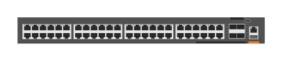

- [Jl726aAruba6200f48Port1gbeAnd4PortSfpSwitchRear](./jl726a-aruba-6200f-48-port-1gbe-and-4-port-sfp-switch-rear.md)  

- [Jl727aAruba6200f48Port1gbeClass4PoeAnd4PortSfp370wSwitch](./jl727a-aruba-6200f-48-port-1gbe-class-4-poe-and-4-port-sfp-370w-switch.md)  

- [Jl727aAruba6200f48Port1gbeClass4PoeAnd4PortSfp370wSwitchRear](./jl727a-aruba-6200f-48-port-1gbe-class-4-poe-and-4-port-sfp-370w-switch-rear.md)  

- [Jl728aAruba6200f48Port1gbeClass4PoeAnd4PortSfp740wSwitch](./jl728a-aruba-6200f-48-port-1gbe-class-4-poe-and-4-port-sfp-740w-switch.md)  

- [Jl728aAruba6200f48Port1gbeClass4PoeAnd4PortSfp740wSwitchRear](./jl728a-aruba-6200f-48-port-1gbe-class-4-poe-and-4-port-sfp-740w-switch-rear.md)  

- [Jl9826a5412r92gPoe4sfpZl2Switch](./jl9826a-5412r-92g-poe-4sfp-zl2-switch.md)  

- [LcSfp](./lc-sfp.md)  

- [R0x26aArubaCx6400Switch](./r0x26a-aruba-cx-6400-switch.md)  
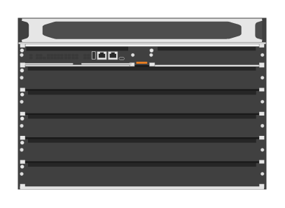

- [R0x26aArubaCx6405SwitchRear](./r0x26a-aruba-cx-6405-switch-rear.md)  

- [R0x27aArubaCx6410Switch](./r0x27a-aruba-cx-6410-switch.md)  

- [R0x27aArubaCx6410SwitchRear](./r0x27a-aruba-cx-6410-switch-rear.md)  

- [R0x31aAruba6400ManagementModule](./r0x31a-aruba-6400-management-module.md)  

- [R0x35aAruba64001800wPsWC16](./r0x35a-aruba-6400-1800w-ps-w-c16.md)  

- [R0x36aAruba64003000wPsWC20](./r0x36a-aruba-6400-3000w-ps-w-c20.md)  

- [R0x38aAruba640048p1gbeCls4PoeModule](./r0x38a-aruba-6400-48p-1gbe-cls4-poe-module.md)  

- [R0x39aAruba640048p1gbeCls4Poe4sfp56Module](./r0x39a-aruba-6400-48p-1gbe-cls4-poe-4sfp56-module.md)  
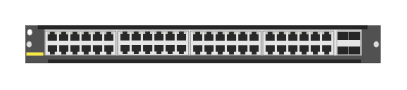

- [R0x40aAruba640048p1gbeCls6Poe4sfp56Module](./r0x40a-aruba-6400-48p-1gbe-cls6-poe-4sfp56-module.md)  

- [R0x41aAruba640048pSmartRateCsl6Poe4sfp56Module](./r0x41a-aruba-6400-48p-smart-rate-csl6-poe-4sfp56-module.md)  

- [R0x42aAruba640024p10gt4sfp56Module](./r0x42a-aruba-6400-24p-10gt-4sfp56-module.md)  

- [R0x43aAruba640024pSfp4sfp56Module](./r0x43a-aruba-6400-24p-sfp-4sfp56-module.md)  

- [R0x44Aruba640048p10g25gSfp28Module](./r0x44-aruba-6400-48p-10g-25g-sfp28-module.md)  

- [R0x45aAruba640012p40g100gQsfp28Module](./r0x45a-aruba-6400-12p-40g-100g-qsfp28-module.md)  

- [Rj45Sfp](./rj45-sfp.md)  

- [Rj45SfpAlt](./rj45-sfp-alt.md)  

- [Rom67aAruba2930mPoeClass6SwitchRear](./rom67a-aruba-2930m-poe-class-6-switch-rear.md)  

- [Rom67aAruba2930m48pPoeClass6Switch](./rom67a-aruba-2930m-48p-poe-class-6-switch.md)  

- [Rom68aAruba2930m24pPoeClass6Switch](./rom68a-aruba-2930m-24p-poe-class-6-switch.md)  

- [Rom68aAruba2930m24pPoeClass6SwitchRear](./rom68a-aruba-2930m-24p-poe-class-6-switch-rear.md)  

