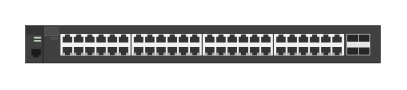

# J9775A 2530-48G Switch

## Definition

```
{
  _style: { 
    entity: 'html=1;verticalLabelPosition=bottom;verticalAlign=top;outlineConnect=0;shadow=0;dashed=0;shape=mxgraph.rack.hpe_aruba.switches.j9775a_2530_48g_switch;',
  },
  _original_width: 142,
  _original_height: 15,
}
```

## Usage

```
import { J9775a253048gSwitch } from '@diac/standard-components-diagrams/rackHpeArubaSwitches'

<J9775a253048gSwitch/>
```

## Preview


