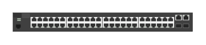

# J9781A 2530-48 (front)

## Definition

```
{
  _style: { 
    entity: 'html=1;verticalLabelPosition=bottom;verticalAlign=top;outlineConnect=0;shadow=0;dashed=0;shape=mxgraph.rack.hpe_aruba.switches.j9781a_2530_48_front;',
  },
  _original_width: 142,
  _original_height: 15,
}
```

## Usage

```
import { J9781a253048Front } from '@dinghy/standard-components-diagrams/rackHpeArubaSwitches'

<J9781a253048Front/>
```

## Preview


