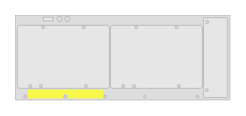

# J9821A 540R zl2 Switch (rear)

## Definition

```
{
  _style: { 
    entity: 'html=1;verticalLabelPosition=bottom;verticalAlign=top;outlineConnect=0;shadow=0;dashed=0;shape=mxgraph.rack.hpe_aruba.switches.j9821a_540r_zl2_switch_rear;',
  },
  _width: 142,
  _height: 56,
}
```

## Usage

```
import { J9821a540rZl2SwitchRear } from '@diac/standard-components-diagrams/rackHpeArubaSwitches'

<J9821a540rZl2SwitchRear/>
```

## Preview


