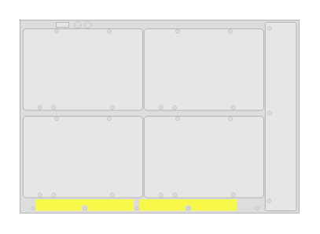

# J9822A 5412R zl2 Switch (rear)

## Definition

```
{
  _style: 'html=1;verticalLabelPosition=bottom;verticalAlign=top;outlineConnect=0;shadow=0;dashed=0;shape=mxgraph.rack.hpe_aruba.switches.j9822a_5412r_zl2_switch_rear;',
  _width: 142,
  _height: 98,
}
```

## Usage

```
import { J9822a5412rZl2SwitchRear } from '@reactiac/standard-components-diagrams/rackHpeArubaSwitches'

<J9822a5412rZl2SwitchRear/>
```

## Preview


