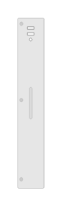

# J9832A 5412R zl2 Switch Fan Tray

## Definition

```
{
  _style: 'html=1;verticalLabelPosition=bottom;verticalAlign=top;outlineConnect=0;shadow=0;dashed=0;shape=mxgraph.rack.hpe_aruba.switches.j9832a_5412r_zl2_switch_fan_tray;',
  _width: 15,
  _height: 96,
}
```

## Usage

```
import { J9832a5412rZl2SwitchFanTray } from '@diac/standard-components-diagrams/rackHpeArubaSwitches'

<J9832a5412rZl2SwitchFanTray/>
```

## Preview


