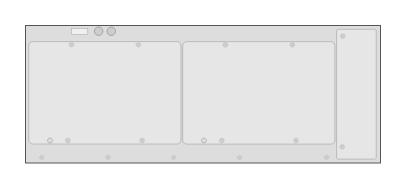

# J9850A 5406R zl2 Switch (rear)

## Definition

```
{
  _style: { 
    entity: 'html=1;verticalLabelPosition=bottom;verticalAlign=top;outlineConnect=0;shadow=0;dashed=0;shape=mxgraph.rack.hpe_aruba.switches.j9850a_5406r_zl2_switch_rear;',
  },
  _original_width: 142,
  _original_height: 55,
}
```

## Usage

```
import { J9850a5406rZl2SwitchRear } from '@dinghy/standard-components-diagrams/rackHpeArubaSwitches'

<J9850a5406rZl2SwitchRear/>
```

## Preview


