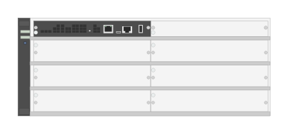

# J9850A 540R zl2 Switch

## Definition

```
{
  _style: 'html=1;verticalLabelPosition=bottom;verticalAlign=top;outlineConnect=0;shadow=0;dashed=0;shape=mxgraph.rack.hpe_aruba.switches.j9850a_540r_zl2_switch;',
  _width: 142,
  _height: 55,
}
```

## Usage

```
import { J9850a540rZl2Switch } from '@diac/standard-components-diagrams/rackHpeArubaSwitches'

<J9850a540rZl2Switch/>
```

## Preview


