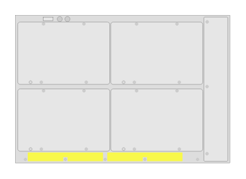

# J9851A 5412R zl2 Switch (rear)

## Definition

```
{
  _style: { 
    entity: 'html=1;verticalLabelPosition=bottom;verticalAlign=top;outlineConnect=0;shadow=0;dashed=0;shape=mxgraph.rack.hpe_aruba.switches.j9851a_5412r_zl2_switch_rear;',
  },
  _original_width: 142,
  _original_height: 98,
}
```

## Usage

```
import { J9851a5412rZl2SwitchRear } from '@dinghy/standard-components-diagrams/rackHpeArubaSwitches'

<J9851a5412rZl2SwitchRear/>
```

## Preview


