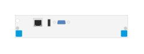

# J9857A Adv Svcs v2 zl Module

## Definition

```
{
  _style: 'html=1;verticalLabelPosition=bottom;verticalAlign=top;outlineConnect=0;shadow=0;dashed=0;shape=mxgraph.rack.hpe_aruba.switches.j9857a_adv_svcs_v2_zl_module;',
  _width: 75,
  _height: 15,
}
```

## Usage

```
import { J9857aAdvSvcsV2ZlModule } from '@diac/standard-components-diagrams/rackHpeArubaSwitches'

<J9857aAdvSvcsV2ZlModule/>
```

## Preview


