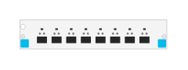

# J993A 8-port 1G 10GbE SFP+ with MACsec v3 zl2 Module

## Definition

```
{
  _style: { 
    entity: 'html=1;verticalLabelPosition=bottom;verticalAlign=top;outlineConnect=0;shadow=0;dashed=0;shape=mxgraph.rack.hpe_aruba.switches.j993a_8_port_1g_10gbe_sfpplus_with_macsec_v3_zl2_module;',
  },
  _original_width: 75,
  _original_height: 15,
}
```

## Usage

```
import { J993a8Port1g10gbeSfpWithMacsecV3Zl2Module } from '@diac/standard-components-diagrams/rackHpeArubaSwitches'

<J993a8Port1g10gbeSfpWithMacsecV3Zl2Module/>
```

## Preview


