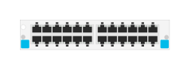

# J9987A 24-port 10/100/1000BASE-T with MACsec v3 zl2 Module

## Definition

```
{
  _style: { 
    entity: 'html=1;verticalLabelPosition=bottom;verticalAlign=top;outlineConnect=0;shadow=0;dashed=0;shape=mxgraph.rack.hpe_aruba.switches.j9987a_24_port_10_100_1000base_t_with_macsec_v3_zl2_module;',
  },
  _width: 75,
  _height: 15,
}
```

## Usage

```
import { J9987a24Port101001000baseTWithMacsecV3Zl2Module } from '@diac/standard-components-diagrams/rackHpeArubaSwitches'

<J9987a24Port101001000baseTWithMacsecV3Zl2Module/>
```

## Preview


