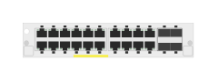

# J9990A 20p GigT 4p SFP+ Module

## Definition

```
{
  _style: { 
    entity: 'html=1;verticalLabelPosition=bottom;verticalAlign=top;outlineConnect=0;shadow=0;dashed=0;shape=mxgraph.rack.hpe_aruba.switches.j9990a_20p_gigt_4p_sfpplus_module;',
  },
  _width: 75,
  _height: 15,
}
```

## Usage

```
import { J9990a20pGigt4pSfpModule } from '@diac/standard-components-diagrams/rackHpeArubaSwitches'

<J9990a20pGigt4pSfpModule/>
```

## Preview


