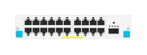

# J9992A 20-port 10/100/1000BASE-T PoE+ and 1-port 40GbE QSFP+ with MACsec v3 zl2 Module

## Definition

```
{
  _style: { 
    entity: 'html=1;verticalLabelPosition=bottom;verticalAlign=top;outlineConnect=0;shadow=0;dashed=0;shape=mxgraph.rack.hpe_aruba.switches.j9992a_20_port_10_100_1000base_t_poeplus_and_1_port_40gbe_qsfpplus_withmacsec_v3_zl2_module;',
  },
  _original_width: 75,
  _original_height: 15,
}
```

## Usage

```
import { J9992a20Port101001000baseTPoeAnd1Port40gbeQsfpWithMacsecV3Zl2Module } from '@diac/standard-components-diagrams/rackHpeArubaSwitches'

<J9992a20Port101001000baseTPoeAnd1Port40gbeQsfpWithMacsecV3Zl2Module/>
```

## Preview


