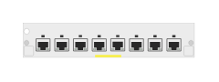

# J9995A 8p Smart Rate PoE+ Module

## Definition

```
{
  _style: { 
    entity: 'html=1;verticalLabelPosition=bottom;verticalAlign=top;outlineConnect=0;shadow=0;dashed=0;shape=mxgraph.rack.hpe_aruba.switches.j9995a_8p_smart_rate_poeplus_module;',
  },
  _width: 75,
  _height: 15,
}
```

## Usage

```
import { J9995a8pSmartRatePoeModule } from '@diac/standard-components-diagrams/rackHpeArubaSwitches'

<J9995a8pSmartRatePoeModule/>
```

## Preview


