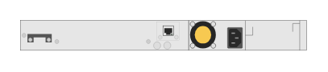

# JL072A HPE Aruba 3810M 48-port GT 1-slot Switch (rear)

## Definition

```
{
  _style: { 
    entity: 'html=1;verticalLabelPosition=bottom;verticalAlign=top;outlineConnect=0;shadow=0;dashed=0;shape=mxgraph.rack.hpe_aruba.switches.jl072a_hpe_aruba_3810m_48_port_gt_1_slot_switch_rear;',
  },
  _width: 142,
  _height: 15,
}
```

## Usage

```
import { Jl072aHpeAruba3810m48PortGt1SlotSwitchRear } from '@diac/standard-components-diagrams/rackHpeArubaSwitches'

<Jl072aHpeAruba3810m48PortGt1SlotSwitchRear/>
```

## Preview


