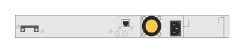

# JL075A HPE Aruba 3810M 16-port SFP+ 2-slot Switch (rear)

## Definition

```
{
  _style: 'html=1;verticalLabelPosition=bottom;verticalAlign=top;outlineConnect=0;shadow=0;dashed=0;shape=mxgraph.rack.hpe_aruba.switches.jl075a_hpe_aruba_3810m_16_port_sfpplus_2_slot_switch_rear;',
  _width: 142,
  _height: 15,
}
```

## Usage

```
import { Jl075aHpeAruba3810m16PortSfp2SlotSwitchRear } from '@diac/standard-components-diagrams/rackHpeArubaSwitches'

<Jl075aHpeAruba3810m16PortSfp2SlotSwitchRear/>
```

## Preview


