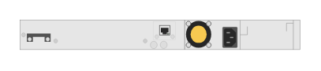

# JL076A HPE Aruba 3810M 40-port GT PoE+ 8-port 1/2.5/5/10GBASE-T PoE+ 1-slot Switch (rear)

## Definition

```
{
  _style: 'html=1;verticalLabelPosition=bottom;verticalAlign=top;outlineConnect=0;shadow=0;dashed=0;shape=mxgraph.rack.hpe_aruba.switches.jl076a_hpe_aruba_3810m_40_port_gt_poeplus_8_port_1_2_5_5_10gbase_t_poeplus_1_slot_switch_rear;',
  _width: 142,
  _height: 15,
}
```

## Usage

```
import { Jl076aHpeAruba3810m40PortGtPoe8Port125510gbaseTPoe1SlotSwitchRear } from '@diac/standard-components-diagrams/rackHpeArubaSwitches'

<Jl076aHpeAruba3810m40PortGtPoe8Port125510gbaseTPoe1SlotSwitchRear/>
```

## Preview


