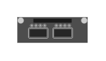

# JL079A3810M 2930M 2-port 40GbE QSFP+ Module

## Definition

```
{
  _style: { 
    entity: 'html=1;verticalLabelPosition=bottom;verticalAlign=top;outlineConnect=0;shadow=0;dashed=0;shape=mxgraph.rack.hpe_aruba.switches.jl079a3810m_2930m_2_port_40gbe_qsfpplus_module;',
  },
  _original_width: 41,
  _original_height: 15,
}
```

## Usage

```
import { Jl079a3810m2930m2Port40gbeQsfpModule } from '@diac/standard-components-diagrams/rackHpeArubaSwitches'

<Jl079a3810m2930m2Port40gbeQsfpModule/>
```

## Preview


