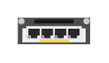

# JL081A 3810M 2930M 4 1/2.5/5/10 GbE HPE Smart Rate Module

## Definition

```
{
  _style: { 
    entity: 'html=1;verticalLabelPosition=bottom;verticalAlign=top;outlineConnect=0;shadow=0;dashed=0;shape=mxgraph.rack.hpe_aruba.switches.jl081a_3810m_2930m_4_1_2_5_5_10_gbe_hpe_smart_rate_module;',
  },
  _original_width: 41,
  _original_height: 15,
}
```

## Usage

```
import { Jl081a3810m2930m4125510GbeHpeSmartRateModule } from '@dinghy/standard-components-diagrams/rackHpeArubaSwitches'

<Jl081a3810m2930m4125510GbeHpeSmartRateModule/>
```

## Preview


