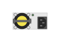

# JL085A Aruba 6300M PSU Module

## Definition

```
{
  _style: { 
    entity: 'html=1;verticalLabelPosition=bottom;verticalAlign=top;outlineConnect=0;shadow=0;dashed=0;shape=mxgraph.rack.hpe_aruba.switches.jl085a_aruba_6300m_psu_module;',
  },
  _original_width: 27,
  _original_height: 13,
}
```

## Usage

```
import { Jl085aAruba6300mPsuModule } from '@diac/standard-components-diagrams/rackHpeArubaSwitches'

<Jl085aAruba6300mPsuModule/>
```

## Preview


