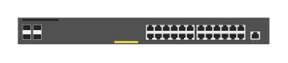

# JL261A Aruba 2930F-24G PoE+ 4SFP switch

## Definition

```
{
  _style: 'html=1;verticalLabelPosition=bottom;verticalAlign=top;outlineConnect=0;shadow=0;dashed=0;shape=mxgraph.rack.hpe_aruba.switches.jl261a_aruba_2930f_24g_poeplus_4sfp_switch;',
  _width: 142,
  _height: 15,
}
```

## Usage

```
import { Jl261aAruba2930f24gPoe4sfpSwitch } from '@reactiac/standard-components-diagrams/rackHpeArubaSwitches'

<Jl261aAruba2930f24gPoe4sfpSwitch/>
```

## Preview


