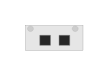

# JL325A 2930M 2-port Stacking Module

## Definition

```
{
  _style: 'html=1;verticalLabelPosition=bottom;verticalAlign=top;outlineConnect=0;shadow=0;dashed=0;shape=mxgraph.rack.hpe_aruba.switches.jl325a_2930m_2_port_stacking_module;',
  _width: 23,
  _height: 10,
}
```

## Usage

```
import { Jl325a2930m2PortStackingModule } from '@diac/standard-components-diagrams/rackHpeArubaSwitches'

<Jl325a2930m2PortStackingModule/>
```

## Preview


