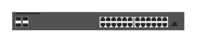

# JL354A Aruba 2540-24G 4SFP+ switch

## Definition

```
{
  _style: 'html=1;verticalLabelPosition=bottom;verticalAlign=top;outlineConnect=0;shadow=0;dashed=0;shape=mxgraph.rack.hpe_aruba.switches.jl354a_aruba_2540_24g_4sfpplus_switch;',
  _width: 142,
  _height: 15,
}
```

## Usage

```
import { Jl354aAruba254024g4sfpSwitch } from '@diac/standard-components-diagrams/rackHpeArubaSwitches'

<Jl354aAruba254024g4sfpSwitch/>
```

## Preview


