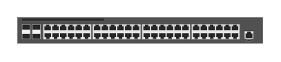

# JL355A Aruba 2540-48G 4SFP Switch

## Definition

```
{
  _style: { 
    entity: 'html=1;verticalLabelPosition=bottom;verticalAlign=top;outlineConnect=0;shadow=0;dashed=0;shape=mxgraph.rack.hpe_aruba.switches.jl355a_aruba_2540_48g_4sfpplus_switch;',
  },
  _original_width: 142,
  _original_height: 15,
}
```

## Usage

```
import { Jl355aAruba254048g4sfpSwitch } from '@diac/standard-components-diagrams/rackHpeArubaSwitches'

<Jl355aAruba254048g4sfpSwitch/>
```

## Preview


