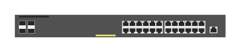

# JL356A Aruba 2540-24G PoE+ 4SFP+ Switch

## Definition

```
{
  _style: { 
    entity: 'html=1;verticalLabelPosition=bottom;verticalAlign=top;outlineConnect=0;shadow=0;dashed=0;shape=mxgraph.rack.hpe_aruba.switches.jl356a_aruba_2540_24g_poeplus_4sfpplus_switch;',
  },
  _original_width: 142,
  _original_height: 15,
}
```

## Usage

```
import { Jl356aAruba254024gPoe4sfpSwitch } from '@dinghy/standard-components-diagrams/rackHpeArubaSwitches'

<Jl356aAruba254024gPoe4sfpSwitch/>
```

## Preview


