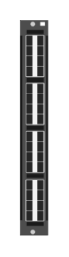

# JL363A-32P SFP+ Adv

## Definition

```
{
  _style: { 
    entity: 'html=1;verticalLabelPosition=bottom;verticalAlign=top;outlineConnect=0;shadow=0;dashed=0;shape=mxgraph.rack.hpe_aruba.switches.jl363a_32p_sfpplus_adv;',
  },
  _width: 14,
  _height: 107,
}
```

## Usage

```
import { Jl363a32pSfpAdv } from '@diac/standard-components-diagrams/rackHpeArubaSwitches'

<Jl363a32pSfpAdv/>
```

## Preview


