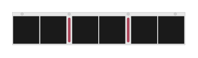

# JL369A Aruba 8400 X731 Fan tray

## Definition

```
{
  _style: { 
    entity: 'html=1;verticalLabelPosition=bottom;verticalAlign=top;outlineConnect=0;shadow=0;dashed=0;shape=mxgraph.rack.hpe_aruba.switches.jl369a_aruba_8400_x731_fan_tray;',
  },
  _width: 142,
  _height: 27,
}
```

## Usage

```
import { Jl369aAruba8400X731FanTray } from '@diac/standard-components-diagrams/rackHpeArubaSwitches'

<Jl369aAruba8400X731FanTray/>
```

## Preview


