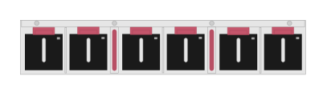

# JL371A Aruba 8400 Fan tray and 6 fans bundle

## Definition

```
{
  _style: { 
    entity: 'html=1;verticalLabelPosition=bottom;verticalAlign=top;outlineConnect=0;shadow=0;dashed=0;shape=mxgraph.rack.hpe_aruba.switches.jl371a_aruba8400_fan_tray_and_6_fans_bundle;',
  },
  _original_width: 142,
  _original_height: 27,
}
```

## Usage

```
import { Jl371aAruba8400FanTrayAnd6FansBundle } from '@dinghy/standard-components-diagrams/rackHpeArubaSwitches'

<Jl371aAruba8400FanTrayAnd6FansBundle/>
```

## Preview


