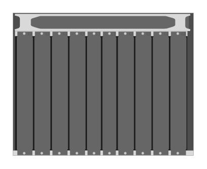

# JL375A Aruba 8400 (front)

## Definition

```
{
  _style: { 
    entity: 'html=1;verticalLabelPosition=bottom;verticalAlign=top;outlineConnect=0;shadow=0;dashed=0;shape=mxgraph.rack.hpe_aruba.switches.jl375a_aruba_8400_front;',
  },
  _original_width: 142,
  _original_height: 112,
}
```

## Usage

```
import { Jl375aAruba8400Front } from '@diac/standard-components-diagrams/rackHpeArubaSwitches'

<Jl375aAruba8400Front/>
```

## Preview


