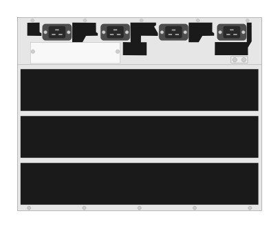

# JL375A Aruba 8400 (rear, empty)

## Definition

```
{
  _style: 'html=1;verticalLabelPosition=bottom;verticalAlign=top;outlineConnect=0;shadow=0;dashed=0;shape=mxgraph.rack.hpe_aruba.switches.jl375a_aruba_8400_rear_empty;',
  _width: 142,
  _height: 112,
}
```

## Usage

```
import { Jl375aAruba8400RearEmpty } from '@diac/standard-components-diagrams/rackHpeArubaSwitches'

<Jl375aAruba8400RearEmpty/>
```

## Preview


