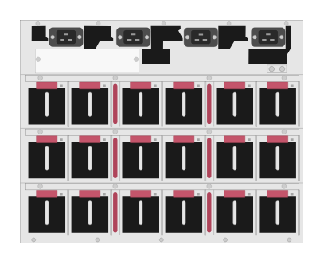

# JL376A Aruba 8400 (rear)

## Definition

```
{
  _style: { 
    entity: 'html=1;verticalLabelPosition=bottom;verticalAlign=top;outlineConnect=0;shadow=0;dashed=0;shape=mxgraph.rack.hpe_aruba.switches.jl376a_aruba_8400_rear;',
  },
  _original_width: 142,
  _original_height: 112,
}
```

## Usage

```
import { Jl376aAruba8400Rear } from '@dinghy/standard-components-diagrams/rackHpeArubaSwitches'

<Jl376aAruba8400Rear/>
```

## Preview


