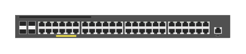

# JL559A Aruba 2930F-48G PoE+ 4SFP+ 740W TAA switch

## Definition

```
{
  _style: { 
    entity: 'html=1;verticalLabelPosition=bottom;verticalAlign=top;outlineConnect=0;shadow=0;dashed=0;shape=mxgraph.rack.hpe_aruba.switches.jl559a_aruba_2930f_48g_poeplus_4sfpplus_740w_taa_switch;',
  },
  _width: 142,
  _height: 15,
}
```

## Usage

```
import { Jl559aAruba2930f48gPoe4sfp740wTaaSwitch } from '@diac/standard-components-diagrams/rackHpeArubaSwitches'

<Jl559aAruba2930f48gPoe4sfp740wTaaSwitch/>
```

## Preview


